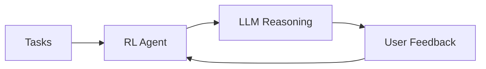

# 🤖 RL Task Agent

**Intelligent Task Management with Reinforcement Learning + Multi-LLM Integration**

[](https://www.python.org/downloads/)
[](https://fastapi.tiangolo.com/)
[](https://streamlit.io/)
[](https://langchain.com/)

## 🚀 Quick Start

### 1. Clone & Install
```bash
git clone https://github.com/blackholeinfiverse78-rgb/RL_Task_Agent.git
cd RL_Task_Agent
pip install -r requirements.txt
```

### 2. Environment Setup
```bash
# Copy environment template
cp .env.example .env

# Edit .env file with your API keys
# Option 1: Gemini (Recommended)
GEMINI_API_KEY=your_gemini_api_key_here

# Option 2: HuggingFace (Alternative)
HUGGINGFACE_API_KEY=your_huggingface_api_key_here

# Option 3: Ollama (Local - no key needed)
# Just install and run: ollama serve
```

### 3. Run Applications
```bash
# Demo UI (Interactive Interface)
streamlit run demo_app.py
# Opens: http://localhost:8501

# Production API (REST Endpoints)
python app.py
# Opens: http://localhost:8001 (or next available port)
```

## ✨ Features

- 🧠 **Multi-LLM Intelligence**: Gemini → HuggingFace → Ollama → RL fallback
- 📈 **Adaptive Learning**: Q-learning algorithm improves suggestions over time
- 🔄 **Smart Fallback**: Automatic provider switching when APIs are unavailable
- 💾 **Flexible Storage**: JSON files or SQLite database
- 🎯 **Interactive UI**: Real-time feedback and learning visualization
- 🔧 **Production Ready**: FastAPI REST API with comprehensive error handling

## 📁 Project Structure

```
rl_task_agent/
├── 🚀 app.py                 # FastAPI production server
├── 🎨 demo_app.py            # Streamlit demo interface
├── 📦 requirements.txt       # Dependencies
│
├── 🧠 task_agent/           # Core intelligence
│   ├── rl_model.py          # Q-learning algorithm
│   ├── langchain_agent.py   # Multi-LLM orchestration
│   ├── database.py          # SQLite operations
│   └── data/               # Persistent storage
│
├── 📚 docs/                 # Documentation
├── 🧪 tests/                # Test suite
└── 🛠️ scripts/              # Utilities
```

## 📖 Documentation

| Guide | Description |
|-------|-------------|
| [📥 Installation](docs/INSTALLATION.md) | Setup and configuration |
| [👤 User Guide](docs/USER_GUIDE.md) | How to use the system |
| [🏗️ Architecture](docs/ARCHITECTURE.md) | System design and components |
| [🔧 Development](docs/DEVELOPMENT.md) | Contributing and extending |
| [📡 API Reference](docs/API_REFERENCE.md) | REST API documentation |
| [📝 Changelog](CHANGELOG.md) | Version history and updates |

## 🧠 LLM Providers

| Provider | Status | Setup | Use Case |
|----------|--------|-------|----------|
| 🥇 **Gemini** | Primary | `GEMINI_API_KEY` | Best performance |
| 🥈 **HuggingFace** | Fallback | `HUGGINGFACE_API_KEY` | Cost-effective |
| 🥉 **Ollama** | Local | `ollama serve` | Privacy-focused |
| 🔄 **RL-Only** | Final | No setup | Always available |

## 🎯 How It Works

1. **📥 Load Tasks** → System reads from JSON/SQLite
2. **🤖 RL Selection** → Q-learning chooses optimal task
3. **💭 LLM Reasoning** → AI explains the recommendation
4. **👤 User Feedback** → Rate completion (0.0-1.0)
5. **📈 Learning** → System improves future suggestions



## 🔗 API Usage Examples

### Basic Commands
```bash
# Get system status
curl http://localhost:8001/

# Get all tasks
curl http://localhost:8001/tasks

# Get task suggestion with AI reasoning
curl -X POST http://localhost:8001/suggest

# Submit feedback (task_id=1, reward=0.8)
curl -X POST http://localhost:8001/feedback/1/0.8

# Mark task as complete
curl -X POST http://localhost:8001/complete/1

# Get learning statistics
curl http://localhost:8001/stats
```

### Response Examples
```json
// GET /suggest
{
  "task": {
    "task_id": 1,
    "name": "Review pull request"
  },
  "reasoning": "This task has high priority...",
  "llm_provider": "gemini",
  "q_value": 0.75
}

// POST /feedback/1/0.8
{
  "task_id": 1,
  "reward": 0.8,
  "q_value_change": "0.500 -> 0.530"
}
```

## 🧪 Testing & Verification

### Quick System Test
```bash
# Test all components
python tests/test_components.py

# Test complete workflow
python tests/workflow_demo.py

# Check system status
python scripts/util_scripts.py status
```

### API Testing
```bash
# Start API server first
python app.py

# Test endpoints (in another terminal)
curl http://localhost:8001/                    # System status
curl http://localhost:8001/tasks               # Get all tasks
curl -X POST http://localhost:8001/suggest     # Get task suggestion
curl -X POST http://localhost:8001/feedback/1/0.8  # Submit feedback
```

### Demo UI Testing
```bash
# Start Streamlit demo
streamlit run demo_app.py

# Then open browser to http://localhost:8501
# 1. Click "Suggest Next Task"
# 2. Rate the suggestion (0.0-1.0)
# 3. Click "Submit Feedback"
# 4. Repeat to see learning in action
```

## 🛠️ Configuration Options

### LLM Providers (Priority Order)
```bash
# 1. Gemini (Primary) - Best performance
GEMINI_API_KEY=your_key

# 2. HuggingFace (Fallback) - Cost effective
HUGGINGFACE_API_KEY=your_key

# 3. Ollama (Local) - Privacy focused
# Install: curl -fsSL https://ollama.ai/install.sh | sh
# Run: ollama serve
# Pull model: ollama pull llama3

# 4. RL-Only (Final fallback) - No LLM needed
```

### Database Options
```bash
# Use SQLite (recommended for production)
USE_SQLITE=true

# Use JSON files (simple, good for development)
USE_SQLITE=false
```

## 🏆 Project Status

**✅ Production Ready** - All components implemented and tested

- ✅ Multi-LLM integration with intelligent fallback
- ✅ Q-learning algorithm with persistent memory  
- ✅ REST API with comprehensive error handling
- ✅ Interactive demo with real-time feedback
- ✅ Flexible storage (JSON/SQLite)
- ✅ Complete documentation and testing

## 🚨 Troubleshooting

### Common Issues

**Port already in use:**
```bash
# App automatically finds free port (8001-8100)
# Check with: netstat -an | findstr :8001
```

**LLM API errors:**
```bash
# Check API keys in .env file
# Verify at: http://localhost:8001/
# System automatically falls back to next provider
```

**Missing dependencies:**
```bash
pip install -r requirements.txt
```

**Database issues:**
```bash
# Reset database
rm task_agent/data/tasks.db
rm task_agent/data/agent_memory.json
```

## 📋 Usage Workflow

### Using the Demo UI
1. **Start the demo**: `streamlit run demo_app.py`
2. **Open browser**: http://localhost:8501
3. **Get suggestion**: Click "Suggest Next Task"
4. **Complete task**: Work on the suggested task
5. **Rate completion**: Use slider (0.0 = poor, 1.0 = excellent)
6. **Submit feedback**: Click "Submit Feedback"
7. **Repeat**: System learns and improves suggestions

### Using the API
1. **Start API**: `python app.py`
2. **Get suggestion**: `curl -X POST http://localhost:8001/suggest`
3. **Submit feedback**: `curl -X POST http://localhost:8001/feedback/{task_id}/{reward}`
4. **Check learning**: `curl http://localhost:8001/stats`

## 🤝 Contributing

See [Development Guide](docs/DEVELOPMENT.md) for setup and contribution guidelines.

## 📄 License

MIT License - see LICENSE file for details.

---

<div align="center">

**Built with ❤️ using FastAPI, LangChain, and Reinforcement Learning**

[📖 Documentation](docs/) • [🚀 Quick Start](#-quick-start) • [🔧 API Examples](#-api-usage-examples) • [🤝 Contributing](docs/DEVELOPMENT.md)

</div>