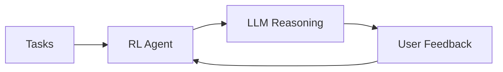

# 🤖 RL Task Agent

**Intelligent Task Management with Reinforcement Learning + Multi-LLM Integration**

[](https://www.python.org/downloads/)
[](https://fastapi.tiangolo.com/)
[](https://streamlit.io/)
[](https://langchain.com/)

## 🚀 Quick Start

```bash
# 1. Install
pip install -r requirements.txt

# 2. Configure (choose one)
export GEMINI_API_KEY="your_key"          # Recommended
export HUGGINGFACE_API_KEY="your_key"     # Alternative
# OR use Ollama locally (no key needed)

# 3. Run
streamlit run demo_app.py    # Demo UI
python app.py               # Production API
```

## ✨ Features

- 🧠 **Multi-LLM Intelligence**: Gemini → HuggingFace → Ollama → RL fallback
- 📈 **Adaptive Learning**: Q-learning algorithm improves suggestions over time
- 🔄 **Smart Fallback**: Automatic provider switching when APIs are unavailable
- 💾 **Flexible Storage**: JSON files or SQLite database
- 🎯 **Interactive UI**: Real-time feedback and learning visualization
- 🔧 **Production Ready**: FastAPI REST API with comprehensive error handling

## 📁 Project Structure

```
rl_task_agent/
├── 🚀 app.py                 # FastAPI production server
├── 🎨 demo_app.py            # Streamlit demo interface
├── 📦 requirements.txt       # Dependencies
│
├── 🧠 task_agent/           # Core intelligence
│   ├── rl_model.py          # Q-learning algorithm
│   ├── langchain_agent.py   # Multi-LLM orchestration
│   ├── database.py          # SQLite operations
│   └── data/               # Persistent storage
│
├── 📚 docs/                 # Documentation
├── 🧪 tests/                # Test suite
└── 🛠️ scripts/              # Utilities
```

## 📖 Documentation

| Guide | Description |
|-------|-------------|
| [📥 Installation](docs/INSTALLATION.md) | Setup and configuration |
| [👤 User Guide](docs/USER_GUIDE.md) | How to use the system |
| [🏗️ Architecture](docs/ARCHITECTURE.md) | System design and components |
| [🔧 Development](docs/DEVELOPMENT.md) | Contributing and extending |
| [📡 API Reference](docs/API_REFERENCE.md) | REST API documentation |
| [📝 Changelog](CHANGELOG.md) | Version history and updates |

## 🧠 LLM Providers

| Provider | Status | Setup | Use Case |
|----------|--------|-------|----------|
| 🥇 **Gemini** | Primary | `GEMINI_API_KEY` | Best performance |
| 🥈 **HuggingFace** | Fallback | `HUGGINGFACE_API_KEY` | Cost-effective |
| 🥉 **Ollama** | Local | `ollama serve` | Privacy-focused |
| 🔄 **RL-Only** | Final | No setup | Always available |

## 🎯 How It Works

1. **📥 Load Tasks** → System reads from JSON/SQLite
2. **🤖 RL Selection** → Q-learning chooses optimal task
3. **💭 LLM Reasoning** → AI explains the recommendation
4. **👤 User Feedback** → Rate completion (0.0-1.0)
5. **📈 Learning** → System improves future suggestions



## 🔗 API Endpoints

| Method | Endpoint | Description |
|--------|----------|-------------|
| `GET` | `/` | System status & configuration |
| `GET` | `/tasks` | Retrieve all tasks |
| `POST` | `/suggest` | Get AI-powered task suggestion |
| `POST` | `/feedback/{task_id}/{reward}` | Submit learning feedback |
| `POST` | `/complete/{task_id}` | Mark task as completed |
| `GET` | `/stats` | Learning statistics & metrics |

## 🧪 Testing

```bash
# Component tests
python tests/test_components.py

# Workflow demonstration
python tests/workflow_demo.py

# System utilities
python scripts/util_scripts.py status
```

## 🏆 Status

**✅ Production Ready** - All components implemented and tested

- ✅ Multi-LLM integration with intelligent fallback
- ✅ Q-learning algorithm with persistent memory
- ✅ REST API with comprehensive error handling
- ✅ Interactive demo with real-time feedback
- ✅ Flexible storage (JSON/SQLite)
- ✅ Complete documentation and testing

## 🤝 Contributing

See [Development Guide](docs/DEVELOPMENT.md) for setup and contribution guidelines.

## 📄 License

MIT License - see LICENSE file for details.

---

<div align="center">

**Built with ❤️ using FastAPI, LangChain, and Reinforcement Learning**

[📖 Documentation](docs/) • [🚀 Quick Start](#-quick-start) • [🔧 API](docs/API_REFERENCE.md) • [🤝 Contributing](docs/DEVELOPMENT.md)

</div>